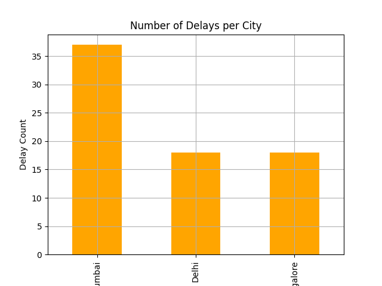
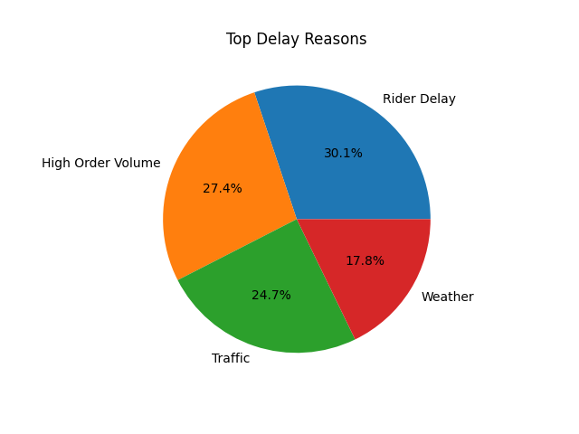
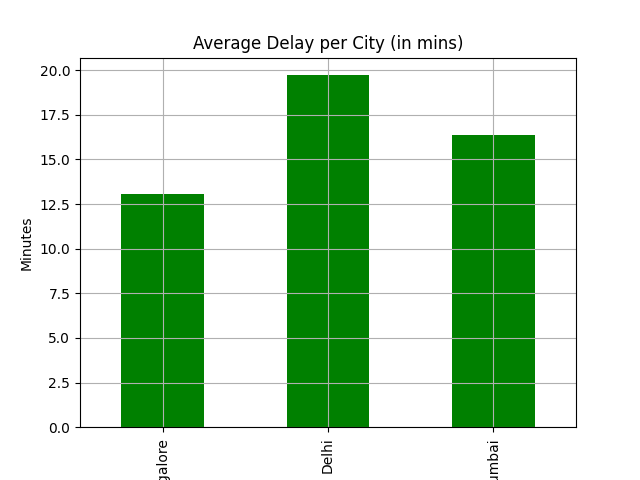

# Order Delay Analysis

A data analysis project that investigates order delivery delays, inspired by Blinkit-style delivery apps.

## Goals
- Identify which cities experience the most delivery delays
- Understand common reasons behind delays
- Provide actionable insights through visual analysis

## Dataset
A synthetic dataset with columns like:
- Order_ID, City, Expected_Time, Delivery_Time, Delay_Reason

## Tools Used
- Python
- Pandas
- Matplotlib
- Jupyter Notebook (VS Code)

## Visual Insights

### 1. Delays by City

### 2. Reasons for Delay

### 3. Average Delay in Minutes

## Result
- **Delhi** and **Mumbai** face the highest number of delays.
- **Rider Delay(30.1%)** is the most common delay reason, followed by **Traffic (24.7%)**  .
- Suggests improving internal rider operations and optimizing delivery routes in traffic-heavy areas.

